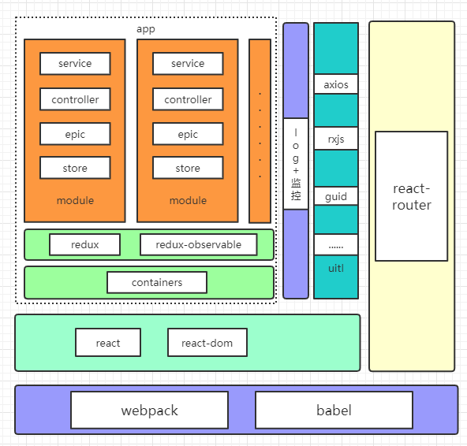
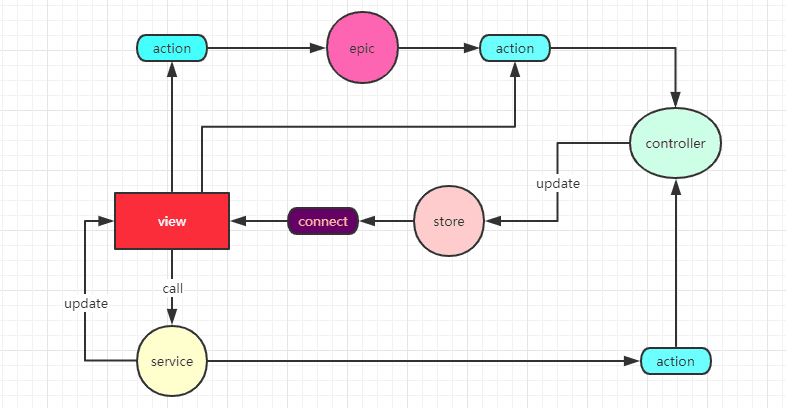

## 简介

**前端模块化解决方案**

### 技术选型

react(^16.8.6) + redux(^4.0.1) + redux-observable(^1.1.0)

- 视图渲染：react

- 数据管理：redux

- 路由控制：react-router

- 异步处理：epics + service

- 编译打包：webpack

### 致力解决的问题
- [ ] 1. 开箱即用
- [x] 2. 纯模块化，一切功能皆模块
- [x] 3. 模块可以高度自由的挂载和卸载
- [x] 4. 模块可以异步加载
- [x] 5. 不同模块之间不会直接影响，但提供跨模块通信方法
- [ ] 6. 支持用户信息、权限等直接注入到模块
- [x] 7. 尽量继承dashboard原写法
- [ ] 8. 请求支持缓存，支持统一loading，支持统一报错
- [x] 9. 自动输出关键日志
- [ ] 10. 持久化关键数据
- [x] 11. 性能检测
- [ ] 12. 容错组件兜底
- [ ] 13. 路由权限控制
- [ ] 14. 打点中间件
- [x] 15. loading状态通过http注入
- [x] 16. 合并多个同步的dispatch，只render一次

### 整体架构

### 数据流图

